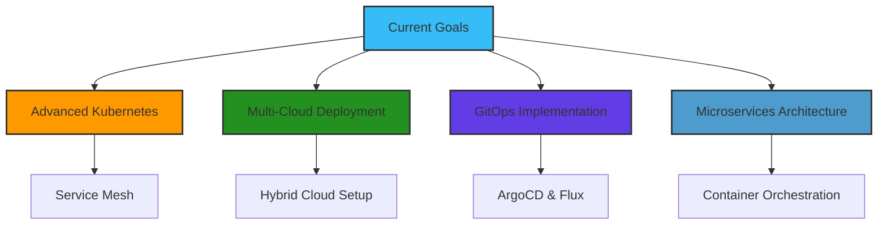

#  Hi there! I'm Pratik Raundale

<div align="center">
  
</div>

<div align="center">
  
</div>

---

## 🚀 About Me


```yaml
apiVersion: v1
kind: Developer
metadata:
  name: Pratik Raundale
  location: Pune, MH 411033
  contact: +91 9359161785
spec:
  role: DevOps Engineer & Cloud Enthusiast
  experience: 
    - Junior Web Developer at Jai Electricals And Contractors
    - 2+ years in DevOps and Cloud Technologies
  education:
    - BTech in Electronics & Telecommunication (CGPA: 8/10)
    - Diploma in Electronics & Telecommunication (85.59%)
  passion: 
    - Automating everything possible
    - Building scalable cloud infrastructure
    - Continuous learning and innovation
```

---

## 🛠️ Tech Stack & Tools

<div align="center">

### 🔧 DevOps & Cloud


### 💻 Programming & Development


### 🌐 Cloud Services


</div>

---

## 📈 GitHub Stats

<div align="center">
  
  
</div>

<div align="center">
  
</div>

<div align="center">
  
</div>

---

## 🏆 Featured Projects

<div align="center">

### 🌟 2-Tier WebApp Deployment


```bash
├── 🐳 Docker Containerization
├── ☸️ Kubernetes Orchestration  
├── 🔄 CI/CD Pipeline
├── ☁️ AWS EKS Deployment
└── 📊 High Availability Setup
```

### 🔧 Jenkins CI/CD Pipeline


```yaml
Pipeline Features:
  ✅ Automated Testing
  ✅ Code Quality Analysis
  ✅ Build Automation
  ✅ Deployment Automation
```

</div>

---

## 🎯 Skills Matrix

<div align="center">

| Category | Technologies | Proficiency |
|----------|-------------|-------------|
| **DevOps** | Docker, Kubernetes, Jenkins |  |
| **Cloud** | AWS (EC2, S3, EKS, IAM) |  |
| **Programming** | C#, .NET, JavaScript |  |
| **IaC** | Terraform, Helm |  |
| **Monitoring** | SonarQube, CodeGuru |  |

</div>

---

## 🏅 Certifications & Achievements

<div align="center">
  
  
</div>

🎖️ **AWS Cloud Essential** - Amazon Web Services  
🎖️ **Introduction to AWS CodeGuru** - Amazon Web Services  
🎖️ **Getting Started With Amazon EKS** - Amazon Web Services  
🏆 **First Place** - JSPM RSCOE Project Competition  
🏆 **First Prize** - Poster Presentation Competition  

---

## 🌐 Connect with Me

<div align="center">
  <a href="https://www.linkedin.com/in/pratik-raundale-953bb61b4/">
    
  </a>
  <a href="https://github.com/pratikraundale12">
    
  </a>
  <a href="https://pratikraundale.netlify.app/">
    
  </a>
  <a href="mailto:pratikraundale12@gmail.com">
    
  </a>
</div>

---

## 💡 Current Focus

<div align="center">
  
</div>



---

## 🎨 Fun Facts

<div align="center">
   <em><b>I love connecting with different people</b> so if you want to say <b>hi, I'll be happy to meet you more!</b> 😊</em>
</div>

<div align="center">
  
  🌱 Currently learning **Advanced Kubernetes & Service Mesh**  
  ⚡ Fun fact: **I automate everything, even my coffee machine!** ☕  
  🎯 Goal: **Become a Cloud Architecture Expert**  
  🚀 Motto: **"Infrastructure as Code, Everything as Code!"**  
  
</div>

---

## 📊 Contribution Graph

<div align="center">
  
</div>

---

## 🎵 Spotify Playing

<div align="center">
  
</div>

---

<div align="center">
  
</div>

<div align="center">
  
  
</div>

---

<div align="center">
  <h3>💭 Random Dev Quote</h3>
  
</div>

<div align="center">
  
</div>
